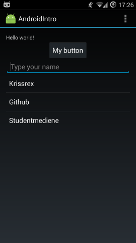

# AndroidIntro
Code example for a simple app.
See https://docs.google.com/presentation/d/1wZTr5vL_PTxZEOYa4cn-tnhnVKIc2ekAI2Di3ElcMLo/pub?start=false&amp;loop=false&amp;delayms=3000 for a norwegian slideshow.

# Functionality
You can type text into an EditText, and push it to a list.
